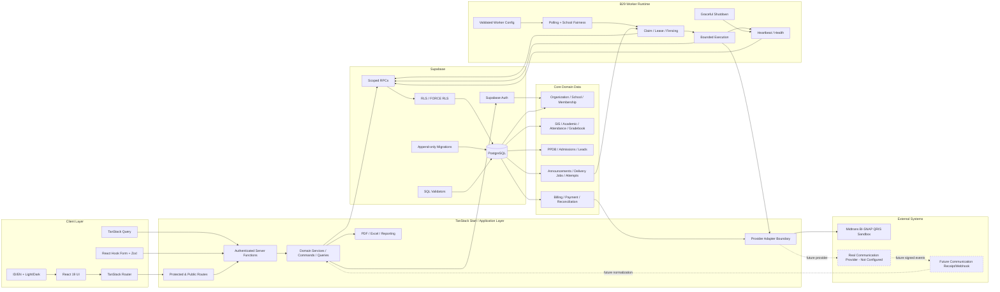

# EduSmart Architecture Flowchart

> **Baseline dokumentasi:** 6 Oktober 2026. Dokumen ini disusun dari implementasi aktual repository `gapaicoding/edusmart-core`, dokumentasi arsitektur/migration/report di repository, serta PRD EduSmart v1.0 yang sebelumnya diberikan. Jika ada konflik, **kode + migration + kontrak keamanan pada `origin/main` menjadi source of truth implementasi**, sedangkan PRD menjadi source of truth untuk visi/roadmap.

## Boundary Penting

1. **Browser tidak memegang service-role credential.**
2. Server function memvalidasi auth/context/capability sebelum domain action.
3. PostgreSQL RLS tetap security authority.
4. B29 worker adalah trusted server process terpisah dari browser user.
5. Delivery claim/finalize adalah server/worker-only.
6. Real communication provider belum dikonfigurasi pada baseline ini.
7. Midtrans berada di payment adapter boundary; provider event tidak menjadi accounting truth tanpa reconciliation.
