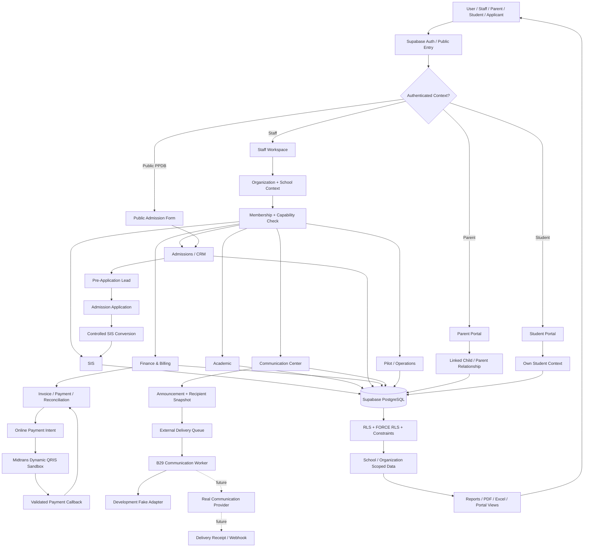

# EduSmart System Flowchart

> **Baseline dokumentasi:** 6 Oktober 2026. Dokumen ini disusun dari implementasi aktual repository `gapaicoding/edusmart-core`, dokumentasi arsitektur/migration/report di repository, serta PRD EduSmart v1.0 yang sebelumnya diberikan. Jika ada konflik, **kode + migration + kontrak keamanan pada `origin/main` menjadi source of truth implementasi**, sedangkan PRD menjadi source of truth untuk visi/roadmap.

Diagram berikut menggambarkan flow sistem tingkat produk/domain, bukan sequence diagram setiap request.

## Interpretasi

- Semua staff action melewati school context + capability.
- RLS/constraint tetap authoritative walaupun UI sudah melakukan gating.
- Admissions lead tidak langsung membuat Student; formal application menjadi boundary.
- Finance memisahkan accounting truth dari provider integration.
- Communication telah memiliki queue + worker, tetapi real provider masih future scope.
